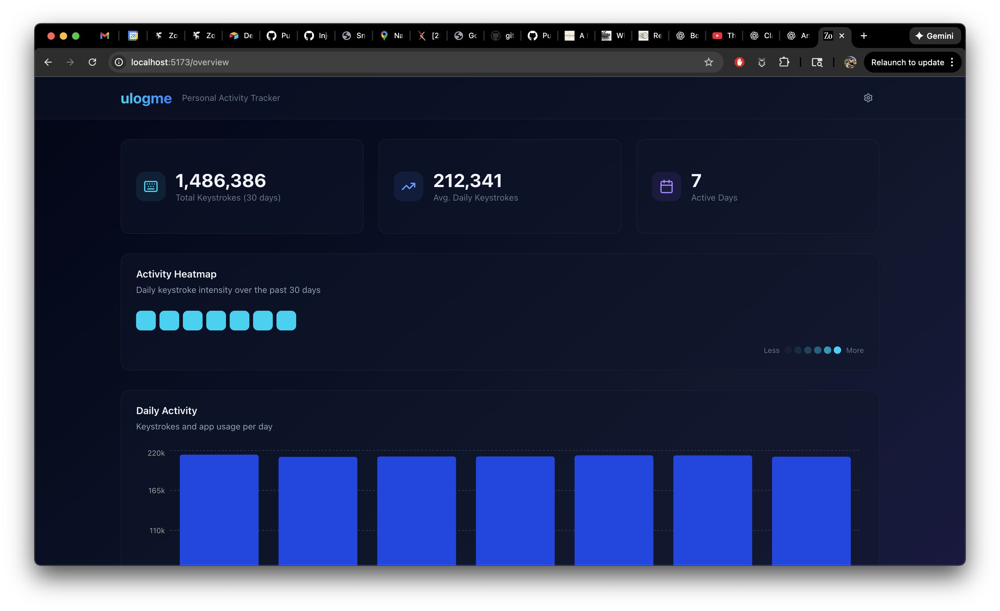
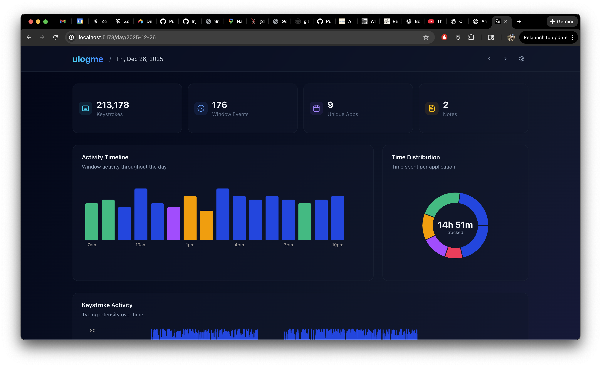
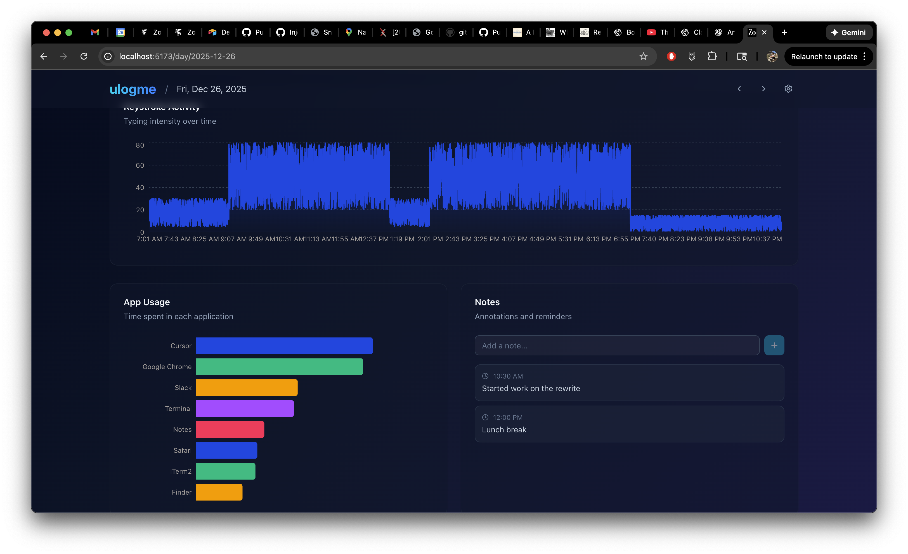

# ulogme - Modern Activity Tracker for macOS

A complete modernization of [karpathy/ulogme](https://github.com/karpathy/ulogme) for modern macOS (Apple Silicon compatible).

> 📜 Looking for the original legacy version? See [old/README.md](old/README.md)

## What is ulogme?

ulogme is a personal activity tracker that runs in the background and logs:
- **Active window titles** — What apps and windows you're using
- **Keystroke counts** — How much you're typing (not what you type!)
- **Browser URLs** — Optional URL tracking for browsers

All data stays on your machine in a local DuckDB database. There are no cloud services or network calls.

## Features

- 🍎 Native macOS support (Apple Silicon & Intel)
- 🔒 Privacy-first: only counts keystrokes, never logs key values
- 📊 Beautiful React dashboard with charts and visualizations
- 📅 Logical day boundaries (late night sessions count as previous day)
- 📝 Add notes and daily blog entries
- ⚡ Fast DuckDB storage with powerful analytics queries

## Screenshots

### Overview Dashboard


### Day View




## Quick Start

### Prerequisites

- macOS 12+ (Monterey or later)
- [uv](https://github.com/astral-sh/uv) — Python package manager
- [Bun](https://bun.sh/) — JavaScript runtime

### 1. Start the Tracker

```bash
# Install Python dependencies
uv sync

# Start the tracker (runs in foreground)
uv run python -m tracker start

# With debug output to see what's being tracked
uv run python -m tracker start --verbose
```

The first time you run the tracker, macOS will prompt you to grant **Accessibility** permission for keystroke monitoring. Go to:
- System Settings → Privacy & Security → Accessibility
- Add your terminal app (Terminal, iTerm, etc.)

### 2. Install as a Service (Optional)

To have the tracker start automatically when you log in:

```bash
uv run python -m tracker install
```

**Important for launchd service:** You need to grant Accessibility permission to the Python binary itself:
1. System Settings → Privacy & Security → Accessibility
2. Click + and press Cmd+Shift+G
3. Navigate to: `~/.local/share/uv/python/cpython-3.13.5-macos-aarch64-none/bin/`
4. Select `python3.13` and click Open

To uninstall:
```bash
uv run python -m tracker uninstall
```

### 3. Start the Web Dashboard

```bash
cd site-template/

# Install dependencies
bun install

# Start the development server
bun run dev
```

Open http://localhost:5173 to view your activity data.

## Commands

### Tracker Daemon

```bash
# Start tracker in foreground
uv run python -m tracker start

# Stop running tracker
uv run python -m tracker stop

# Check status
uv run python -m tracker status

# Install as launchd service (auto-start on login)
uv run python -m tracker install

# Remove launchd service
uv run python -m tracker uninstall
```

### Web Dashboard

```bash
cd site-template/

# Development mode with hot reload
bun run dev

# Production build
bun run build
bun run prod
```

## Configuration

Edit `ulogme.toml` to customize:

```toml
[tracking]
window_titles = true    # Track window titles
browser_tabs = true     # Track browser tab titles  
browser_urls = true     # Track full URLs (enables URL-based categorization)
keystrokes = true       # Count keystrokes
window_poll_interval = 2  # Seconds between window checks
keystroke_window = 9    # Seconds to aggregate keystrokes

[day_boundary]
hour = 7  # Day starts at 7am (late night = previous day)

[hacking]
# Categories considered "focused work" for hacking streak
categories = ["Coding", "Terminal", "Dev", "AI"]
```

### Category Mappings

Categories are assigned via regex patterns in order (first match wins). URL-based rules let you distinguish browser activity:

```toml
# AI assistants
[[category_mappings.rules]]
pattern = "chatgpt\\.com|claude\\.ai|perplexity\\.ai"
category = "AI"

# Browser URLs (matched against window title which contains the URL)
[[category_mappings.rules]]
pattern = "mail\\.google\\.com|outlook\\.live\\.com"
category = "Email"

[[category_mappings.rules]]
pattern = "github\\.com|stackoverflow\\.com"
category = "Coding"

[[category_mappings.rules]]
pattern = "localhost|127\\.0\\.0\\.1"
category = "Dev"

[[category_mappings.rules]]
pattern = "twitter\\.com|x\\.com|reddit\\.com"
category = "Social"

[[category_mappings.rules]]
pattern = "youtube\\.com|netflix\\.com"
category = "Video"

# Native apps (fallback after URL rules)
[[category_mappings.rules]]
pattern = "VS Code|Cursor|PyCharm"
category = "Coding"

[[category_mappings.rules]]
pattern = "Terminal|iTerm|Warp"
category = "Terminal"

# Generic browser (catch-all, should be last)
[[category_mappings.rules]]
pattern = "Google Chrome|Safari|Arc"
category = "Browser"
```

Categories are applied dynamically at display time — updating the config immediately affects all historical data (no backfill needed).

## Project Structure

```
ulogme/
├── tracker/              # Python daemon
│   ├── daemon.py         # Main entry point
│   ├── window.py         # Window tracking (PyObjC)
│   ├── keyboard.py       # Keystroke counting
│   ├── storage.py        # DuckDB operations
│   ├── config.py         # Configuration loading
│   └── launchd.py        # macOS service integration
├── site-template/        # React dashboard
│   ├── server.ts         # Hono API server
│   ├── backend-lib/
│   │   ├── ulogme-db.ts  # DuckDB queries
│   │   └── config.ts     # TOML config & categorization
│   └── src/
│       ├── pages/        # React pages (DayView, Overview, Settings)
│       └── components/   # UI components (charts, panels)
├── data/                 # Database and logs
│   └── ulogme.duckdb
├── old/                  # Legacy Python 2.7 version
│   └── README.md         # Original documentation
├── pyproject.toml        # Python dependencies
├── ulogme.toml           # Configuration (edit this!)
└── REWRITE_PLAN.md       # Architecture documentation
```

## Data Storage

All data is stored in `data/ulogme.duckdb`, a local DuckDB database file.

### Tables

- `window_events` — Active window changes with timestamps
- `key_events` — Keystroke counts per time window
- `notes` — User annotations
- `daily_blog` — Daily journal entries
- `settings` — User preferences

### Querying the Database

```bash
# Quick check of recent data
uv run python -c "
import duckdb
conn = duckdb.connect('data/ulogme.duckdb', read_only=True)
print('Window events:', conn.execute('SELECT COUNT(*) FROM window_events').fetchone()[0])
print('Key events:', conn.execute('SELECT COUNT(*) FROM key_events').fetchone()[0])
print('Latest:', conn.execute('SELECT timestamp, app_name FROM window_events ORDER BY timestamp DESC LIMIT 3').fetchall())
conn.close()
"
```

## API Endpoints

The web dashboard exposes a REST API:

| Endpoint | Description |
|----------|-------------|
| `GET /api/ulogme/dates` | List all dates with data |
| `GET /api/ulogme/day/:date` | Get all data for a specific date |
| `GET /api/ulogme/day/:date/categories` | Get category breakdown with durations |
| `GET /api/ulogme/day/:date/apps` | Get app usage breakdown |
| `GET /api/ulogme/overview` | Get aggregated stats across dates |
| `GET /api/ulogme/config` | Get category rules and colors |
| `POST /api/ulogme/note` | Add a note |
| `PUT /api/ulogme/blog/:date` | Save daily blog entry |

## Troubleshooting

### Tracker not logging data

1. **Check if it's running:**
   ```bash
   uv run python -m tracker status
   ```

2. **Run in verbose mode to debug:**
   ```bash
   uv run python -m tracker start --verbose
   ```
   You should see `[HH:MM:SS] poll tick` every 2 seconds and window/keystroke events.

3. **Check for errors in logs:**
   ```bash
   cat data/tracker.log
   cat data/tracker.error.log
   ```

### Keystrokes not counting

Keystroke monitoring requires **Accessibility permission**:
- For foreground mode: Grant permission to your terminal app
- For launchd service: Grant permission to the Python binary itself

### Database lock errors

If you see "Conflicting lock" errors, make sure only one process is writing:
- Stop the web server before running database queries
- The tracker briefly locks the DB for writes every few seconds

### Service not starting on login

Check the launchd status:
```bash
launchctl list | grep ulogme
```
Exit code `0` = running, any other number = check logs.

## Privacy & Security

1. **Keystroke counting only** — We never log actual key characters
2. **Local storage only** — All data stays on your machine
3. **No network calls** — The tracker daemon is fully offline
4. **Accessibility permission** — Required for global key monitoring

## Tech Stack

| Layer | Technology |
|-------|-----------|
| Package Managers | uv (Python), Bun (TypeScript) |
| Database | DuckDB (embedded, columnar, analytics-optimized) |
| Backend | Hono on Bun |
| Frontend | React 19 + Vite + Tailwind CSS + shadcn/ui |
| Charts | Recharts via shadcn/ui ChartContainer |
| Tracker | Python 3.13 + PyObjC (native macOS APIs) |

## Credits

Original project: [karpathy/ulogme](https://github.com/karpathy/ulogme) by Andrej Karpathy

This is a complete rewrite with modern tooling while preserving the core concepts.
